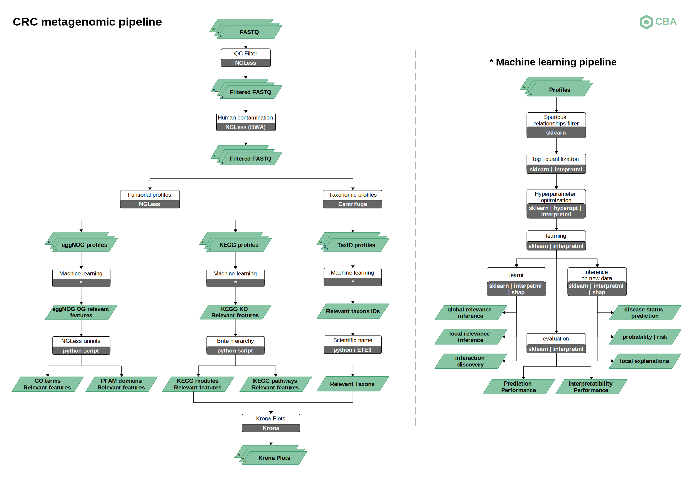

# metagenomic-crc

## Description
Here are the scripts used in metagenomic-crc pipeline for colorectal cancer samples. 
In the bioinfo directory are the ngless escript and the scripts used to analyze the results from machine learning. 
In the machine learning directory are the scripts used in machine learning pipeline.

## General pipeline

